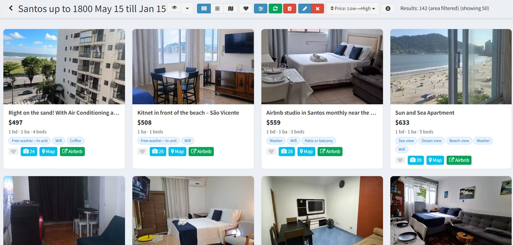
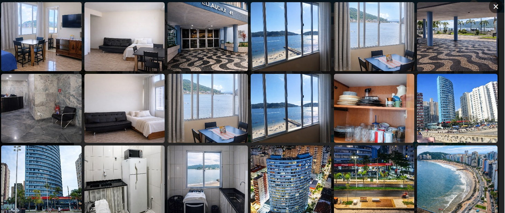
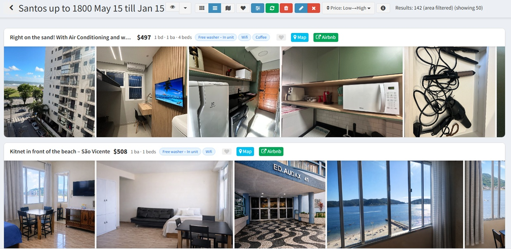
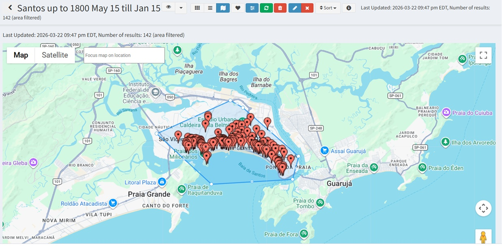
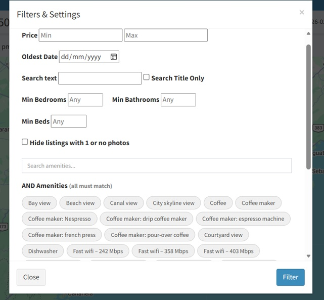
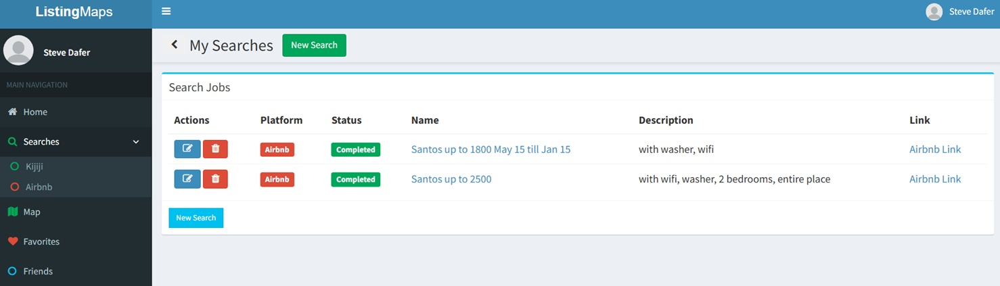
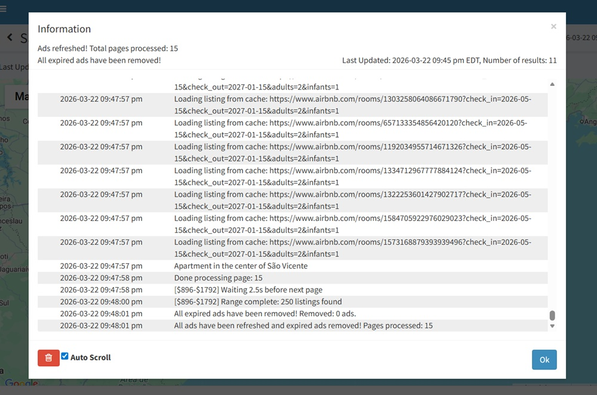

# Place Kijiji & Airbnb listings on a map with advanced search and filters
Fun with node and express.
The Kijiji site (used to) not show ads on a map. When looking for an apartment, it is not very convenient.
Just do a search on the site then copy paste the url.
The ads are scraped and cached in a mongodb database.

## Screenshots

**Map View** - Visualize listings on an interactive map

**Grid Gallery** - Browse property photos in a grid layout

**Column View** - Alternative list view for listings

**Map Drawing Filters** - Draw custom areas on the map to filter results

**Advanced Search Filters** - Filter by amenities, price, and custom criteria

**Saved Searches** - Manage and organize your searches

**Live Scraping** - Monitor scraping progress with info modal

## Features

✨ **See All Results at Once** - No pagination, no infinite scroll. All listings are loaded upfront and available immediately on the map.

🗺️ **Complete Map Visualization** - Unlike standard map interfaces, every single listing is visible at all zoom levels. No hidden results that only appear when you zoom in.

🎯 **Custom Geometry Filtering** - Draw custom shapes directly on the map to filter listings by location. More intuitive than traditional bounding box searches.

🏠 **Multi-Source Search** - Search both Kijiji and Airbnb listings in one unified interface. Compare properties across platforms instantly.

📸 **Photo Gallery** - Browse high-quality property photos in a grid layout with sorting and filtering options.

⚡ **Local Caching** - All results are cached locally in MongoDB. Filter and search instantly without waiting for server responses.

❤️ **Save Favorites** - Mark your favorite listings for quick access. Your favorites persist across sessions.

🔍 **Advanced Filtering** - Filter by amenities, price range, keywords, and custom criteria. Saved filters remember your preferences. Filter by **any amenity** listed in the properties — even ones Airbnb and Kijiji don't let you filter by.

📊 **Multiple Views** - Switch between map view, grid gallery, and column view to find properties the way you prefer.

🔄 **Persistent State** - Your search filters, sorting preferences, and view settings are remembered automatically.

## Setup
Docker Compose provided, so you just need to:

1- Setup the .env file in the top directory (example.env is provided, copy it to .env and modify it)

2- Change the Google Map Key in app/views/index.html

3- Change the apiURL in views/js/API/common.js

4- Provide a Facebook App Id if you want to use Facebook Login

Real-time updates work automatically via WebSocket since frontend is hosted on the same instance as backend.

## Technology Stack
- Node.js with Express backend
- MongoDB for data persistence
- Docker Compose for easy deployment
- Yarn package manager
- Real-time communication via WebSocket

## Quick Start
1. Sign up and create a new search
2. Copy-paste the first page's link of your search from Kijiji or Airbnb
3. Wait for all pages to be fetched (results reload with each page, but refresh at the end to ensure all are loaded)
4. Once fetching is complete, all results are cached locally in MongoDB for instant filtering

---

**Note**: This is meant for simple use and fun only; it does not necessarily reflect my coding style nor best practices.
